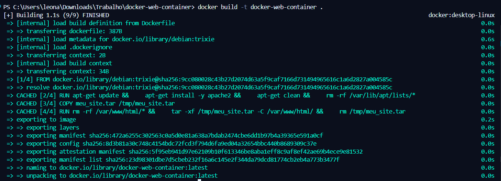
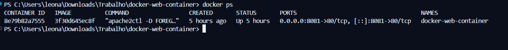
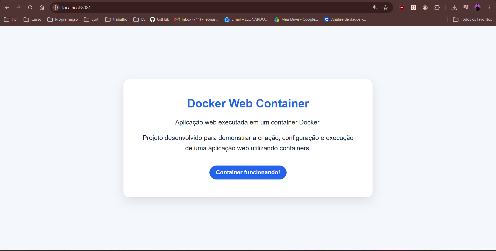

# Docker Web Container

Projeto desenvolvido para demonstrar a criação e execução de uma aplicação web utilizando Docker e uma imagem baseada em Debian.

## Comandos utilizados

```bash
docker build -t docker-web-container .
docker run -d --name docker-web-container -p 8081:80 docker-web-container
docker ps
```

## IMAGEM CRIADA




## SAIDA NO CMD

```bash
docker run -d --name docker-web-container -p 8081:80 docker-web-container
```

```bash
CONTAINER ID   IMAGE          COMMAND                  CREATED       STATUS       PORTS                                     NAMES
8e79b82a7555   3f30d645ec8f   "apache2ctl -D FOREG…"   5 hours ago   Up 5 hours   0.0.0.0:8081->80/tcp, [::]:8081->80/tcp   docker-web-container
```

## Site Rodando



## Tecnologias

- Docker
- Debian
- Apache HTTP Server
- HTML5
- CSS3

## Estrutura do projeto

```text
docker-web-container/
├── Dockerfile
├── meu_site.tar
├── README.md
└── screenshots/
    ├── docker-build.png
    ├── docker-container.png
    └── web-running.png
